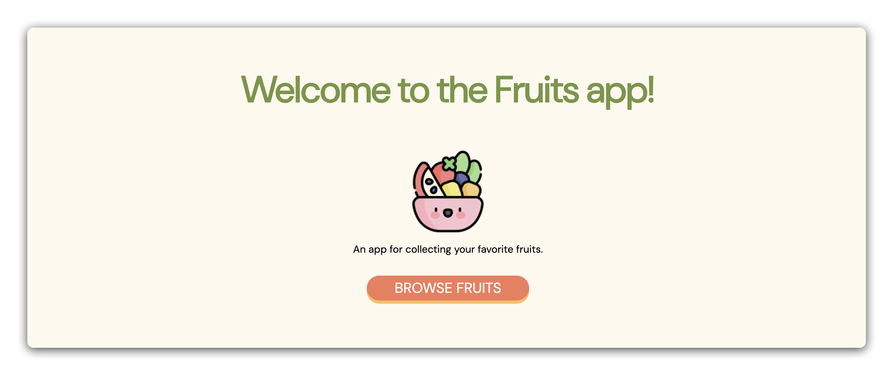

<h1>
  MEN Stack CRUD App
  Fruits
</h1>

## About

Welcome to the "Fruits" App, a comprehensive module for intermediate learners ready to build a full-stack CRUD application. This module covers essential full-stack development skills, focusing on creating, reading, updating, and deleting data in a web application using Node.js, Express, and EJS. It's the perfect next step for those with foundational web development knowledge, who are ready to work with a database for the first time.

## Content

| Lesson                                                                               | Skills                                                |
| ------------------------------------------------------------------------------------ | ----------------------------------------------------- |
| [Setup](./setup/README.md)                                                           | Setting up the development environment                |
| [Build and Run `server.js`](./build-and-run-serverjs/README.md)                      | Create a basic Express server                         |
| [Build a Landing Page](./build-a-landing-page/README.md)                             | Implement a landing page using Express and EJS        |
| [Use Mongoose to Connect to MongoDB](./use-mongoose-to-connect-to-mongodb/README.md) | Connect to MongoDB Atlas via connection string        |
| [Build the Fruit Model](./build-the-fruit-model/README.md)                           | Define and export a Mongoose model                    |
| [Build the New Fruit Page](./build-the-new-fruit-page/README.md)                     | Construct a `new` route and view                      |
| [Create a Fruit](./create-a-fruit/README.md)                                         | Build `create` functionality in a `POST` route        |
| [Build the Fruits Index Page](./build-the-fruits-index-page/README.md)               | Find and render all fruits on an `index` page         |
| [Build the Fruits Show Page](./build-the-fruits-show-page/README.md)                 | Construct a `show` route and view                     |
| [Delete a Fruit](./delete-a-fruit/README.md)                                         | Build `delete` functionality in a `DELETE` route      |
| [Build the Edit Fruit Page](./build-the-edit-fruit-page/README.md)                   | Construct an `edit` route and view                    |
| [Update a Fruit](./update-a-fruit/README.md)                                         | Build `update` functionality in a `PUT` route         |
| [Recap](./recap/README.md)                                                           | Review technologies used and application architecture |
| [Style the Application](./style-the-application/README.md)                           | Bring your app to life with CSS                       |

## References

📖 [Reference Materials](./references/README.md)

## Internal

### Prerequisites

- Intro to Express
- RESTful Routing
- EJS
- Intro to Mongoose

### Solution code

🏁 [Solution code](https://git.generalassemb.ly/modular-curriculum-all-courses/men-stack-crud-app-fruits-solution)

### Course landing pages

- [SEB - Software Engineering Bootcamp](https://ga-curriculum.github.io/men-stack-crud-app-fruits/canvas-landing-pages/seb.html)
- [Fallback](https://ga-curriculum.github.io/men-stack-crud-app-fruits/canvas-landing-pages/fallback.html)

### Resources

✏️ [Instructor Guide](./internal-resources/instructor-guide.md)

🎥 [Video Hub](./internal-resources/video-hub.md)

🏗️ [Release Notes](./internal-resources/release-notes.md)

---

**Find a 👾 bug 👾 or have suggestions? [Let us know](https://ga-curriculum.github.io/universal-resources-internal/module-feedback.html)!**
